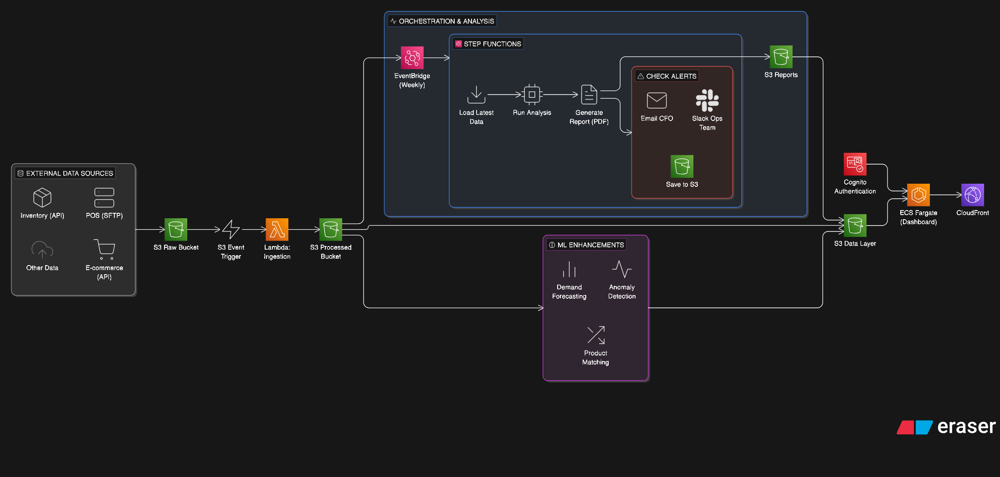

# Retail Inventory Reconciliation & Analysis

A data integration and analysis project for reconciling inventory across POS, inventory management, and e-commerce systems.

## Quick Start

```bash
# Install dependencies
pip install -e .

# Copy environment file
cp .env.example .env
# Add your OpenAI API key to .env (optional, for AI insights)

# Option 1: Run the analysis notebook
jupyter notebook notebooks/inventory_analysis.ipynb

# Option 2: Launch the interactive dashboard
streamlit run app.py
```

## Project Structure

```
├── app.py                    # Streamlit dashboard
├── data/
│   ├── raw/                  # Source data files
│   │   ├── pos_transactions.csv
│   │   ├── inventory_management.xlsx
│   │   └── ecommerce_export.json
│   └── processed/            # Cleaned/merged data (generated)
├── notebooks/
│   └── inventory_analysis.ipynb  # Main analysis walkthrough
├── outputs/
│   ├── executive_summary.md      # CFO-ready summary
│   ├── stockout_risks.csv        # Products at risk
│   ├── dead_inventory.csv        # Non-moving stock
│   └── key_metrics.json          # Summary metrics
├── src/
│   ├── core/                 # Reusable components
│   │   ├── parsers.py        # Date/SKU normalization
│   │   ├── quality.py        # Data quality framework
│   │   ├── reconciliation.py # Cross-system matching
│   │   ├── analysis.py       # Inventory health metrics
│   │   └── insights.py       # AI-powered insights
│   └── clients/              # Client-specific adapters
│       └── retail_client.py  # This client's data loader
├── FUTURE_WORK.md            # Production architecture plans
└── pyproject.toml
```

## What's Reusable vs. Client-Specific

### Reusable (src/core/)

These components can be used for any retail client with minimal changes:

| Module              | Purpose                                                |
| ------------------- | ------------------------------------------------------ |
| `parsers.py`        | Handles common date formats, SKU variations            |
| `quality.py`        | Configurable data quality checking framework           |
| `reconciliation.py` | Cross-system matching by ID or name                    |
| `analysis.py`       | Stockout risk, dead inventory, velocity calculations   |
| `insights.py`       | AI insight generation with Pydantic structured outputs |

### Client-Specific (src/clients/)

This contains hardcoded logic for this client:

- Column name mappings for their exports
- Notes column parsing patterns (e.g., "Adj: +15 per Sarah 5/4")
- SKU prefix patterns specific to their POS
- Payment method normalization rules

**To adapt for a new client:** Copy `retail_client.py`, update the column mappings and parsing rules.

## AI-Assisted Insights

The project uses OpenAI's GPT-4 with structured outputs (Pydantic models) to generate insights. See `src/core/insights.py` for the implementation.

### Architecture

```
┌─────────────────────────────────────────────────────────────┐
│                    Pre-computed Data                         │
│  (pandas calculations: velocity, stockout risk, dead inv)   │
└─────────────────────────┬───────────────────────────────────┘
                          │
                          ▼
┌─────────────────────────────────────────────────────────────┐
│                   InsightGenerator                           │
│  • Receives verified numbers as input                        │
│  • Asks LLM to interpret and generate recommendations       │
│  • Uses Pydantic models for structured output               │
└─────────────────────────┬───────────────────────────────────┘
                          │
                          ▼
┌─────────────────────────────────────────────────────────────┐
│              InventoryHealthReport (Pydantic)               │
│  • executive_summary: str                                    │
│  • stockout_risks: list[StockoutRisk]                       │
│  • dead_inventory: list[DeadInventory]                      │
│  • data_quality_recommendations: list[...]                  │
└─────────────────────────────────────────────────────────────┘
```

### What the AI Does Well

| Task | Why AI Works |
|------|--------------|
| **Natural language summaries** | Turns numbers into CFO-readable prose |
| **Pattern synthesis** | "15 dead items are all 'New Product' entries" |
| **Prioritization logic** | Weighs urgency, business impact, effort |
| **Actionable recommendations** | "Run clearance event" vs. just "dead stock exists" |

### What We Don't Trust the AI With

| Task | Why We Verify Programmatically |
|------|-------------------------------|
| **Numeric calculations** | LLMs hallucinate numbers; we compute velocity, days_of_stock, value_at_risk in pandas |
| **Product identification** | SKUs/names are passed in, not generated |
| **Data quality counts** | "20% missing store_id" comes from `df.isna().sum()`, not the LLM |
| **Rankings** | Stockout list is sorted by `days_of_stock` before AI sees it |

### Example: What We Corrected

The LLM initially suggested "consider discontinuing" for dead inventory items. Looking at the actual data, these were "New Product X - Not Yet Active" items that had never been launched. The correct recommendation (which we guided via prompt) was "activate for sale or return to vendor" - a business decision the AI couldn't infer without context.

Set `OPENAI_API_KEY` in your `.env` to enable AI features.

## Key Findings

See `outputs/executive_summary.md` for the CFO-ready summary.

### Inventory Health Results

| Finding | Count | Impact |
|---------|-------|--------|
| Products at stockout risk | 190 (93%) | Revenue at risk |
| — Critical (≤3 days) | 97 | Reorder immediately |
| — High (≤7 days) | 93 | Reorder this week |
| Dead inventory | 15 products | $121K tied up |
| Duplicate product codes | 51 | Unreliable counts |

### Data Quality Issues Found & Fixed

1. **POS System**
   - 4+ date formats across transactions → Multi-format parser
   - 20% of transactions missing store_id
   - Placeholder dates (1900-01-01) → Filtered before analysis
   - TEST/VOID transactions in production data

2. **Inventory System**
   - 51 products have duplicate names with different item codes → Aggregated by name
   - Manual overrides in Notes column indicate system distrust
   - 15 "New Product" items never activated for sale ($121K dead stock)

3. **Cross-System**
   - No common product identifier → Matched by normalized name
   - Historical data analysis → Used reference_date from data, not system date

### Recommendations

1. **This week:** Emergency reorder for 97 critical stockout items
2. **This month:** Decide fate of 15 inactive "New Product" items ($121K)
3. **This quarter:** Consolidate 51 duplicate product codes
4. **System fix:** Implement unified product ID across systems

## Running Tests

```bash
pytest tests/
```

## What I Would Do With More Time

See [FUTURE_WORK.md](FUTURE_WORK.md) for detailed production architecture plans, including:

- **Automated Pipeline:** S3 triggers → Lambda ingestion → processed data lake
- **Scheduled Reports:** Weekly PDF reports emailed to CFO
- **Real-time Alerts:** Slack notifications for critical stockouts
- **Self-Service Dashboard:** ECS-hosted Streamlit with Cognito auth

### Additional Enhancements

- Fuzzy name matching for product reconciliation (embeddings-based)
- Demand forecasting with Prophet for better stockout prediction
- Historical trend analysis for velocity calculations
- Anomaly detection for data quality issues


